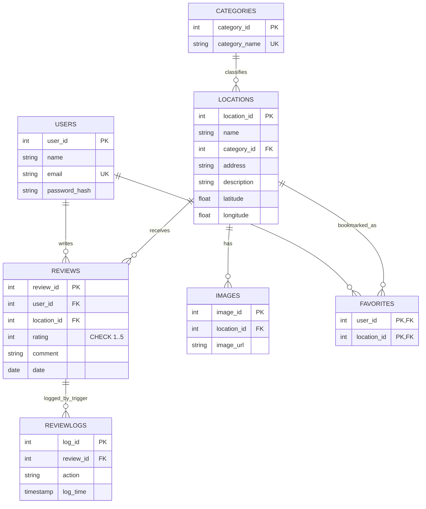

# Manipal Map Project Report

## 1. Executive Summary
The Manipal Location and Review Management System is a map-first information platform built for students and visitors in and around Manipal. It combines location discovery, user reviews, favorites, and category-based filtering in a single application.

From a Database Management Systems perspective, this project demonstrates how a real-world geographic application can be modeled with normalized relational tables, integrity constraints, SQL analytics, and database-side automation (trigger/function).

---

## 2. Project Need and Problem Context (DBMS-Oriented)
### Why this project is needed
Students and new visitors often face practical questions:
- Where are important places on campus and nearby?
- Which locations are best rated by peers?
- Which places belong to specific categories (Academic, Cafe, Hostel, Sports, etc.)?

A static map does not solve these effectively because it lacks structured metadata, user-generated reviews, and analytical querying.

### Why DBMS is central to this solution
A DBMS is required to:
- Persist location, user, and review data reliably
- Enforce consistency and integrity across related entities
- Support multi-table analytical queries (JOIN, GROUP BY, HAVING, CTE)
- Provide scalability from local SQLite usage to PostgreSQL deployment

So, the project is not only a mapping app; it is a relational data system with a map as the primary interaction layer.

---

## 3. Project Scope and Objectives
### Functional objectives
- Store categorized locations with coordinates and descriptions
- Allow user registration/login and secure authentication
- Allow logged-in users to submit reviews and save favorites
- Provide map-based exploration and category filtering
- Provide SQL analytics for ratings and engagement

---

## 4. Database Design Features Implemented

### 4.1 Normalization (3NF-oriented design)
The schema separates entities into independent tables:
- Categories
- Users
- Locations
- Reviews
- Images
- Favorites
- ReviewLogs

This reduces redundancy and update anomalies by storing each concept once and linking via keys. Non-key attributes are kept dependent on their table's key, making the model aligned with Third Normal Form principles.

### 4.2 Referential Integrity
Foreign keys enforce valid relationships:
- Locations.category_id -> Categories.category_id
- Reviews.user_id -> Users.user_id
- Reviews.location_id -> Locations.location_id
- Images.location_id -> Locations.location_id
- Favorites.user_id -> Users.user_id
- Favorites.location_id -> Locations.location_id
- ReviewLogs.review_id -> Reviews.review_id

SQLite foreign key enforcement is explicitly enabled using PRAGMA foreign_keys = ON.

### 4.3 Composite Key Usage
The Favorites table uses a composite primary key:
- PRIMARY KEY (user_id, location_id)

This ensures the same user cannot save the same location more than once.

### 4.4 Constraint Design
Implemented constraint categories include:
- Primary Keys on core entities
- Unique constraints:
  - Categories.category_name
  - Users.email
- Not Null constraints on mandatory fields
- Check constraint:
  - Reviews.rating BETWEEN 1 AND 5
- Foreign key constraints for parent-child consistency

### 4.5 Database-side Automation and Reusable Logic
- Trigger:
  - trg_log_review_insert logs each inserted review into ReviewLogs
- View:
  - location_avg_rating provides pre-aggregated rating summaries
- Function (PostgreSQL):
  - add_review_and_get_avg inserts a review and returns updated average rating

---

## 5. Tables in the Database

| Table | Purpose | Primary Key | Key Relationships |
|---|---|---|---|
| Categories | Master list of place categories | category_id | Referenced by Locations |
| Users | User identity and authentication details | user_id | Referenced by Reviews and Favorites |
| Locations | Geographic points with metadata | location_id | Linked to Categories; parent for Reviews/Images/Favorites |
| Reviews | User feedback on locations | review_id | FK to Users and Locations |
| Images | Location image references | image_id | FK to Locations |
| Favorites | User-saved locations | (user_id, location_id) composite | FK to Users and Locations |
| ReviewLogs | Audit log for review inserts | log_id | FK to Reviews |

---

## 6. ER Diagram of Core Schema

---

## 7. SQL Query Types Used in the Project

### 7.1 CRUD and Transactional Queries
- Insert operations for categories, users, locations, reviews, favorites
- Select operations for location detail views and review listing
- Parameterized SQL for secure query execution

### 7.2 Join and Aggregation Queries
- Average rating per location using GROUP BY and AVG
- Top-rated locations using HAVING with minimum review count
- Location detail pages using LEFT JOIN across related tables

### 7.3 CTE-based Analytical Queries
- Most reviewed locations using a review_counts CTE
- Users with most reviews using a user_review_counts CTE

### 7.4 Database Function / Procedure-style Logic
- PostgreSQL function add_review_and_get_avg performs:
  - rating validation
  - review insert
  - average recomputation and return value
- SQLite fallback is implemented in transactional Python SQL logic to provide equivalent behavior

### 7.5 Trigger Usage
- AFTER INSERT trigger on Reviews logs actions in ReviewLogs for auditing

### 7.6 Views
- location_avg_rating view encapsulates reusable aggregate logic

### 7.7 Cursors
- Explicit SQL cursors are not used in the current implementation
- Reason: current operations are set-based and efficiently expressed with JOIN/CTE/aggregates
- Future scope: cursors may be introduced for procedural row-wise tasks in advanced PostgreSQL workflows

---

## 8. Frontend, Tech Stack, and DB Communication

### Frontend
- Framework: Streamlit
- Map Layer: Folium with streamlit-folium integration
- UX pattern: map-first interface with detail card and analytics page

### Backend/Data Layer
- Python with SQLAlchemy engine and raw parameterized SQL text queries
- Supports:
  - SQLite as default local database
  - PostgreSQL via DATABASE_URL for advanced deployment

### Security and access control highlights
- Password hashing via PBKDF2-HMAC (SHA-256)
- Login-gated actions for adding locations/reviews/favorites
- Unique email and category constraints at database level

### How frontend communicates with the database
- UI events (button/form submit) call query functions
- Query functions execute SQL commands through SQLAlchemy connections
- Results are converted to DataFrames and rendered in Streamlit tables/cards/maps

In short: Streamlit UI -> query function layer -> SQLAlchemy engine -> SQL database.

---

## 9. Current Constraints and Drawbacks
- Limited advanced authentication features (no password reset, MFA, or session expiration policies)
- Role-based access control is minimal (admin/moderator roles are not modeled yet)
- Images are stored as URL references only, not as managed media assets
- Cursor-based procedural analytics are not implemented
- Potential scalability limits in high-concurrency mode when using SQLite
- Trigger logging currently focuses on insert events only; update/delete audit coverage can be expanded
- No dedicated geospatial indexing layer yet for very large location datasets

---

## 10. Conclusion
The Manipal Map project successfully demonstrates a practical DBMS-backed application where relational modeling, integrity enforcement, SQL analytics, and map-based UI work together.

Key DBMS outcomes achieved:
- A normalized schema aligned with 3NF principles
- Referential integrity through foreign keys
- Composite key design for many-to-many favorites mapping
- Constraint-driven data quality
- Trigger/view/function usage for reusable and auditable database behavior

As a result, the project is both a usable campus utility and a strong academic demonstration of applied Database Management Systems concepts.

---

## 11. Suggested PPT Conversion Plan (Optional)
1. Problem Statement and Need
2. DBMS Context and Why Relational Design
3. Architecture and Tech Stack
4. Schema Overview and Table Design
5. ER Diagram
6. Constraints and Integrity Features
7. Query Types and Analytics
8. Frontend Workflow and SQL Interaction
9. Limitations and Future Work
10. Conclusion and Demo Snapshot
